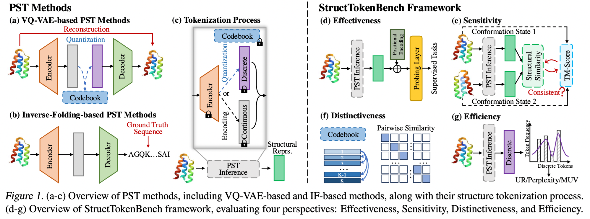
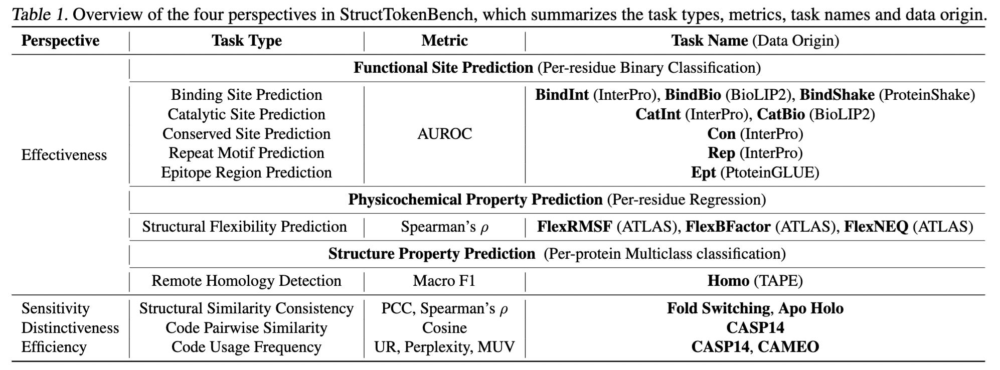

<div align="center">

# Protein Structure Tokenization: Benchmarking and New Recipe

[](https://pytorch.org/get-started/locally/)
[](https://arxiv.org/abs/2503.00089)
[](https://huggingface.co/collections/katarinayuan/...)


</div>


PyTorch implementation of [StructTokenBench], a benchmark for comprehensive evaluation on protein strcuture tokenization methods, and [AminoAseed], an advanced VQ-VAE-based protein structure tokenizer. Code authored by [Xinyu Yuan], and [Zichen Wang].

[Xinyu Yuan]: https://github.com/KatarinaYuan
[Zichen Wang]: https://github.com/wangz10
[StructTokenBench]: https://github.com/KatarinaYuan/StructTokenBench
[AminoAseed]: https://arxiv.org/abs/2503.00089

# Overview

**StructTokenBench** is a benchmark for comprehensively evaluating protein strcuture tokenization methods. We further developed **AminoAseed** that achieves an average of 6.31% performance improvement across 24 supervised tasks, 12.83% in sensitivity and 124.03%, compared to the leading model ESM3.

This repository is based on PyTorch 2.2 and Python 3.11



Table of contents:
- [Protein Structure Tokenization: Benchmarking and New Recipe](#protein-structure-tokenization-benchmarking-and-new-recipe)
- [Overview](#overview)
- [Features](#features)
- [Updates](#updates)
- [Installation](#installation)
- [General Configuration](#general-configuration)
- [Download](#download)
  - [Model Checkpoints](#model-checkpoints)
  - [Pre-training Datasets](#pre-training-datasets)
  - [Downstream Datasets](#downstream-datasets)
- [StructTokenBench - Benchmarking](#structtokenbench---benchmarking)
  - [Setup](#setup)
  - [Effectiveness](#effectiveness)
    - [Functional Site Prediction (Per-residue Binary Classification)](#functional-site-prediction-per-residue-binary-classification)
      - [Binding Site Prediction](#binding-site-prediction)
      - [Catalytic Site Prediction](#catalytic-site-prediction)
      - [Conserved Site Prediction](#conserved-site-prediction)
      - [Repeat Motif Prediction](#repeat-motif-prediction)
      - [Epitope Region Prediction](#epitope-region-prediction)
    - [Physicochemical Property Prediction (Per-residue Regression)](#physicochemical-property-prediction-per-residue-regression)
      - [Structural Flexibility Prediction](#structural-flexibility-prediction)
    - [Structure Property Prediction (Per-protein Multiclass classification)](#structure-property-prediction-per-protein-multiclass-classification)
      - [Remote Homology Detection](#remote-homology-detection)
  - [Sensitivity](#sensitivity)
    - [Structural Similarity Consistency](#structural-similarity-consistency)
  - [Distinctiveness](#distinctiveness)
    - [Code Pairwise Similarity](#code-pairwise-similarity)
  - [Codebook Utilization (Efficiency)](#codebook-utilization-efficiency)
    - [Code Usage Frequency or Compression Ratio](#code-usage-frequency-or-compression-ratio)
- [AminoAseed - Our Structure Tokenizer](#aminoaseed---our-structure-tokenizer)
  - [Pre-train VanillaVQ and AminoAseed](#pre-train-vanillavq-and-aminoaseed)
- [Citation](#citation)


# Features

- **A comprehensive benchmark** for protein structure tokenizers, encompassing 9 different protein structure tokenizers.
- **Easy to extend** to new structure tokenizers, and new datasets.
- **Pretraining recipe** to reproduce ESM3's structure tokenizer
- **All data preprocessing details** to curate residue-level protein supervised tasks

# Updates

- May 1st, 2025: StructTokenBench is accepted to ICML 2025!
- Apr 24th, 2025: StructTokenBench code released!
- Feb 28th, 2025: StructTokenBench preprint release on arxiv!

# Installation

You may install the dependencies via the following bash command using conda environment.

```bash
conda create -n pstbench python=3.11
conda install pytorch==2.2.2 pytorch-cuda=12.1 -c pytorch -c nvidia
pip install lmdb
pip install --upgrade packaging  
pip install hydra-core
pip install lightning
pip install transformers
pip install deepspeed
pip install -U tensorboard
pip install ipdb
pip install esm
pip install cloudpathlib
pip install pipreqs
pip install lxml
pip install proteinshake
pip install tmtools
pip install tape_proteins
pip install torch-scatter -f https://data.pyg.org/whl/torch-2.2.0+cu121.html

pip install accelerate
pip install torch_geometric
pip install line_profiler
pip install mini3di
pip install dm-tree
pip install colorcet
pip install ogb==1.2.1
pip install sympy
pip install ase
pip install torch-cluster

pip install jax==0.4.25
pip install tensorflow
pip install biopython
pip install seaborn
```

To enable [Cheap](https://github.com/amyxlu/cheap-proteins), conflicts need to be resolved to install both esm3 and esm2,
see `./src/baselines/README.md` for details

# General Configuration

```bash
export DIR=<your working directory>
```

# Download
## Model Checkpoints
```bash
CKPT_DIR=$DIR/struct_token_bench_release_ckpt
cd $CKPT_DIR
gdown https://drive.google.com/drive/folders/1s6mz6MQ7x1XLjt4veET7QT5fZ43_xO7n -O ./codebook_512x1024-1e+19-linear-fixed-last.ckpt --folder
gdown https://drive.google.com/drive/folders/1hl7gAe_Hn1pYQ3ow790ArISVbJ2lmJ8b -O ./codebook_512x1024-1e+19-PST-last.ckpt --folder
```


## Pre-training Datasets
First download all the pdb files, which would also be useful for downstreams: 
```bash
DOWNLOAD_DIR=$DIR/pdb_data/mmcif_files
cd $DOWNLOAD_DIR
aws s3 cp s3://openfold/pdb_mmcif.zip $DOWNLOAD_DIR --no-sign-request
unzip pdb_mmcif.zip
wget https://files.pdbj.org/pub/pdb/data/status/obsolete.dat
```
which should result in the following file structure:
```
├── pdb_data
│   └── mmcif_files
│       ├── mmcif_files
│       │   └──xxx.cif
│       ├── obsolete.dat
```

Then download the pretraining subsampled pdb indices list:
```bash
DOWNLOAD_DIR=$DIR/pdb_data/
cd $DOWNLOAD_DIR
gdown https://drive.google.com/uc?id=1UGPbnxeNwlg1jt514J6Foo07pQJEizHy
unzip pretrain.zip
mv pretrain_zip pretrain
```

## Downstream Datasets
Using the following command: 

```
cd $DIR
gdown https://drive.google.com/uc?id=1wJ4dSNdMyuF0985ET4UuwViHgV-clF4K
unzip struct_token_bench_release_data_download.zip
mv struct_token_bench_release_data_download struct_token_bench_release_data
```
which should result in the following file structure:
```
├── struct_token_bench_release_data
│   ├── data
│       ├── CATH
│       │   ├── cath-classification-data
│       │   └── sequence-data
│       ├── functional
│       │   └── local
│       │       ├── biolip2
│       │       ├── interpro
│       │       ├── proteinglue_epitoperegion
│       │       └── proteinshake_bindingsite
│       ├── physicochemical
│       │   ├── atlas
│       ├── sensitivity
│       │   ├── conformational
│       ├── structural
│       │   ├── remote_homology
│       ├── utility
│       │   ├── cameo
│       │   └── casp14
```


# StructTokenBench - Benchmarking



## Setup

Across four perspectives, preprare the following arguments (taking ESM3 as an example):

```bash
tokenizer=WrappedESM3Tokenizer
tokenizername=esm3
d_model=128
lr=0.001
EXTRA_MODEL_ARGS=""

# '...' needs to be filled with the content below, different for each task
EXTRA_TASK_ARGS=...
target_field=... experiment_prefix=...

SHARED_ARGS="tokenizer=$tokenizer model.d_model=$d_model trainer.devices=[0] optimization.optimizer.lr=$lr data.target_field=$target_field experiment_name=${experiment_prefix}_${tokenizername}_lr${lr} run_name=tryout_test default_data_dir=$DIR/struct_token_bench_release_data/ data.pdb_data_dir=$DIR/pdb_data/mmcif_files/ trainer.default_root_dir=$DIR/struct_token_bench_logs/ ${EXTRA_TASK_ARGS} ${EXTRA_MODEL_ARGS}"

# task-specific python command
```

For ESM3, remember to login onto user's HuggingFace account to get access to ESM3:
```python
from huggingface_hub import login
login(token=xxx)
```

Benchmark all different tokenizers, using the following arguments:

```bash
tokenizer_list=(WrappedESM3Tokenizer WrappedFoldSeekTokenizer WrappedProTokensTokenizer WrappedProteinMPNNTokenizer WrappedMIFTokenizer WrappedCheapS1D64Tokenizer WrappedAIDOTokenizer)
tokenizer_name_list=(esm3 foldseek protokens proteinmpnn mif cheapS1D64 aido)
dmodel_list=(128 2 32 128 256 64 384)

for i in "${!tokenizer_list[@]}"
do
    tokenizer=${tokenizer_list[i]}
    tokenizername=${tokenizer_name_list[i]}
    d_model=${dmodel_list[i]}
    echo $tokenizer, $d_model
    for lr in "0.1" "0.01" "0.001" "0.0001" "0.00005" "0.00001" "0.000005" "0.000001";
    do
        echo $lr, "bindint_${tokenizername}_lr${lr}"
        EXTRA_MODEL_ARGS=""
        
        # EXTRA_TASK_ARGS=...
        # target_field=... experiment_prefix=...
        
        SHARED_ARGS="tokenizer=$tokenizer model.d_model=$d_model trainer.devices=[0] optimization.optimizer.lr=$lr data.target_field=$target_field experiment_name=${experiment_prefix}_${tokenizername}_lr${lr} run_name=tryout_test default_data_dir=$DIR/struct_token_bench_release_data/ data.pdb_data_dir=$DIR/pdb_data/mmcif_files/ ${EXTRA_TASK_ARGS} ${EXTRA_MODEL_ARGS}"
        
        # task-specific python command
    done
done
```

Benchmark our pretrained tokenizer (AminoAseed or VanillaVQ). Remember to download the checkpoints first (see [Model checkpoints](#model-checkpoints)). Use the following commands:

```bash
# using AminoAseed
ckpt_name="AminoAseed"
path="$DIR/struct_token_bench_release_ckpt/codebook_512x1024-1e+19-linear-fixed-last.ckpt/checkpoint/mp_rank_00_model_states.pt"
quantizer_use_linear_project=true

# using VanillaVQ
ckpt_name="VanillaVQ"
path="$DIR/struct_token_bench_release_ckpt/codebook_512x1024-1e+19-PST-last.ckpt/checkpoint/mp_rank_00_model_states.pt"
quantizer_use_linear_project=false

# general extra arguments besides $SHARED_ARGS
tokenizer=WrappedOurPretrainedTokenizer
tokenizername=ourpretrained_${ckpt_name}
d_model=1024
lr=0.001
quantizer_codebook_size=512

EXTRA_MODEL_ARGS="tokenizer_pretrained_ckpt_path=$path tokenizer_ckpt_name=${ckpt_name} quantizer_codebook_size=$quantizer_codebook_size quantizer_codebook_embed_size=$d_model model_encoder_dout=$d_model quantizer_use_linear_project=$quantizer_use_linear_project"

```

## Effectiveness
All augments are summarized in table for reference. See below for details and python running commands.

| Task| Database| `target_field` | `experiment_prefix` | `config_file` | `EXTRA_TASK_ARGS` |
|--- |--- |--- |--- |--- |--- |
| BindInt | InterPro | "binding_label" | "bindint" | interpro.yaml | / |
| BindBio | BioLIP2 | "binding_label" | "bindbio" | biolip2.yaml | / |
| BindShake | ProteinShake | "binding_site" | "bindshake" | proteinshake_binding_site.yaml | / |
| CatInt | InterPro | "activesite_label" | "catint" | interpro.yaml | / |
| CatBio | BioLIP2 | "catalytic_label" | "catbio" | biolip2.yaml  | / |
| Con | InterPro | "conservedsite_label" | "con" | interpro.yaml | / |
| Rep | InterPro | "repeat_label" | "rep" | interpro.yaml | / |
| Ept | PtoteinGLUE | "epitope_label" | "ept" | proteinglue_epitope_region.yaml | / |
| FlexRMSF | ATLAS | "rmsf_score" | "flexrmsf" | atlas.yaml | data.pdb_data_dir=$DIR/struct_token_bench_release_data/data/physicochemical/ lightning.callbacks.checkpoint.monitor="validation_spearmanr" |
| FlexBFactor | ATLAS | "bfactor_score" | "flexbfactor" | atlas.yaml | data.pdb_data_dir=$DIR/struct_token_bench_release_data/data/physicochemical/ lightning.callbacks.checkpoint.monitor="validation_spearmanr" |
| FlexNEQ | ATLAS | "neq_score" | "flexneq" | atlas.yaml | data.pdb_data_dir=$DIR/struct_token_bench_release_data/data/physicochemical/ lightning.callbacks.checkpoint.monitor="validation_spearmanr" |
| Homo | TAPE | "fold_label" | "homo" | remote_homology.yaml | optimization.micro_batch_size=64| 


### Functional Site Prediction (Per-residue Binary Classification)
#### Binding Site Prediction
```bash
# BindInt (from InterPro database)
target_field="binding_label" experiment_prefix="bindint"
EXTRA_TASK_ARGS=""
CUDA_VISIBLE_DEVICES=0 python ./src/script/run_supervised_task.py --config-name=interpro.yaml $SHARED_ARGS


# BindBio (from BioLIP2 database)
target_field="binding_label" experiment_prefix="bindbio"
EXTRA_TASK_ARGS=""
CUDA_VISIBLE_DEVICES=0 python ./src/script/run_supervised_task.py --config-name=biolip2.yaml $SHARED_ARGS 


# BindShake (from ProteinShake database)
target_field="binding_site" experiment_prefix="bindshake"
EXTRA_TASK_ARGS=""
CUDA_VISIBLE_DEVICES=0 python ./src/script/run_supervised_task.py --config-name=proteinshake_binding_site.yaml $SHARED_ARGS
```

#### Catalytic Site Prediction
```bash
# CatInt (from InterPro database)
target_field="activesite_label" experiment_prefix="catint"
EXTRA_TASK_ARGS=""
CUDA_VISIBLE_DEVICES=0 python ./src/script/run_supervised_task.py --config-name=interpro.yaml $SHARED_ARGS 


# CatBio (from BioLIP2 database)
target_field="catalytic_label" experiment_prefix="catbio"
EXTRA_TASK_ARGS=""
CUDA_VISIBLE_DEVICES=0 python ./src/script/run_supervised_task.py --config-name=biolip2.yaml $SHARED_ARGS
```

#### Conserved Site Prediction

```bash
# Con (from InterPro database)
target_field="conservedsite_label" experiment_prefix="con"
EXTRA_TASK_ARGS=""
CUDA_VISIBLE_DEVICES=0 python ./src/script/run_supervised_task.py --config-name=interpro.yaml $SHARED_ARGS
```

#### Repeat Motif Prediction
```bash
# Rep (from InterPro database)
target_field="repeat_label" experiment_prefix="rep"
EXTRA_TASK_ARGS=""
CUDA_VISIBLE_DEVICES=0 python ./src/script/run_supervised_task.py --config-name=interpro.yaml $SHARED_ARGS

```
#### Epitope Region Prediction
```bash
# Ept (from PtoteinGLUE database)
target_field="epitope_label" experiment_prefix="ept"
EXTRA_TASK_ARGS=""
CUDA_VISIBLE_DEVICES=0 python ./src/script/run_supervised_task.py --config-name=proteinglue_epitope_region.yaml  $SHARED_ARGS


```

### Physicochemical Property Prediction (Per-residue Regression)

#### Structural Flexibility Prediction
```bash
# FlexRMSF (from ATLAS database)
target_field="rmsf_score" experiment_prefix="flexrmsf"

# FlexBFactor (from ATLAS database)
target_field="bfactor_score" experiment_prefix="flexbfactor"

# FlexNEQ (from ATLAS database)
target_field="neq_score" experiment_prefix="flexneq"

# EXTRA_TASK_ARGS and python commands are shared for FlexRMSF, FlexBFactor and FlexNEQ
EXTRA_TASK_ARGS="data.pdb_data_dir=$DIR/struct_token_bench_release_data/data/physicochemical/ lightning.callbacks.checkpoint.monitor='validation_spearmanr'"
CUDA_VISIBLE_DEVICES=0 python ./src/script/run_supervised_task.py --config-name=atlas.yaml $SHARED_ARGS

```

### Structure Property Prediction (Per-protein Multiclass classification)
#### Remote Homology Detection
```bash
# Homo (TAPE)
target_field="fold_label" experiment_prefix="homo"
EXTRA_TASK_ARGS=optimization.micro_batch_size=64
CUDA_VISIBLE_DEVICES=0 python ./src/script/run_supervised_task.py --config-name=remote_homology.yaml $SHARED_ARGS
```


## Sensitivity
### Structural Similarity Consistency
```bash
target_field="tm_score" experiment_prefix="conformational"
EXTRA_TASK_ARGS="test_only=true experiment_name=${experiment_prefix}_${tokenizername}"

CUDA_VISIBLE_DEVICES=0 python ./src/script/run_supervised_task.py --config-name=conformational_switch.yaml $SHARED_ARGS


```
## Distinctiveness
### Code Pairwise Similarity
```bash

target_field=null task_goal="codebook_diversity" experiment_prefix="${task_goal}_casp14"
EXTRA_TASK_ARGS="test_only=true model.task_goal=${task_goal} experiment_name=${experiment_prefix}_${tokenizername} optimization.micro_batch_size=1"

CUDA_VISIBLE_DEVICES=0 python ./src/script/run_supervised_task.py --config-name=casp14.yaml  $SHARED_ARGS

# after getting all pairwise similarities from different tokenizers, visualze with the following code
python run_plot_codebook_diversity.py

```

## Codebook Utilization (Efficiency)
### Code Usage Frequency or Compression Ratio
```bash
# CASP14

target_field=null task_goal="codebook_utilization" experiment_prefix="${task_goal}_casp14"
EXTRA_TASK_ARGS="test_only=true model.task_goal=${task_goal} experiment_name=${experiment_prefix}_${tokenizername} optimization.micro_batch_size=1"

CUDA_VISIBLE_DEVICES=0 python ./src/script/run_supervised_task.py --config-name=casp14.yaml  $SHARED_ARGS

# CAMEO
target_field=null task_goal="codebook_utilization" experiment_prefix="${task_goal}_cameo"
EXTRA_TASK_ARGS="test_only=true model.task_goal=${task_goal} experiment_name=${experiment_prefix}_${tokenizername} optimization.micro_batch_size=1"

CUDA_VISIBLE_DEVICES=0 python ./src/script/run_supervised_task.py --config-name=cameo.yaml  $SHARED_ARGS

```


# AminoAseed - Our Structure Tokenizer

Please first run code for `Code Usage Frequency` under `Codebook Utilization` evaluation
with ESM3 tokenizer to preprocess the test data CASP14 and CAMEO.


## Pre-train VanillaVQ and AminoAseed
```bash
# VanillaVQ
use_linear_project=false
freeze_codebook=false
model_name="VanillaVQ"

# AminoAseed
use_linear_project=true
freeze_codebook=true
model_name="AminoAseed"
  

# shared command
warmup_step=5426
total_step=108530
lr=0.0001
fast_dev=false # enable to debug with 500 samples

python ./src/script/run_pretraining_vqvae.py --config-name=pretrain.yaml \      
    tokenizer=WrappedESM3Tokenizer trainer.devices=[0,1,2,3] \
    optimization.micro_batch_size=4 \
    optimization.scheduler.num_warmup_steps=${warmup_step} \
    max_steps=${total_step} \
    optimization.optimizer.lr=$lr \
    optimization.scheduler.plateau_ratio=0.0 \
    lightning.callbacks.checkpoint.monitor="validation_bb_rmsd" \
    lightning.callbacks.checkpoint.mode="min" \
    lightning.callbacks.checkpoint.save_top_k=1 \
    trainer.log_every_n_steps=512 \
    data.fast_dev_run=${fast_dev} \
    data.data_version=mmcif_files_filtered_subsample10 \
    experiment_name=vqvae-pretrain-subsample10_${model_name}_fastdev${fast_dev} \
    run_name=test \
    model.quantizer.use_linear_project=${use_linear_project} \
    model.quantizer.freeze_codebook=${freeze_codebook} \
    model.ckpt_path='' \
    default_data_dir=$DIR/struct_token_bench_release_data/ \
    data.pdb_data_dir=$DIR/pdb_data/mmcif_files/ \
    trainer.default_root_dir=$DIR/struct_token_bench_logs/

```


# Citation

If you find this codebase useful in your research, please cite the original papers.

```bibtex
@article{yuan2025protein,
  title={Protein Structure Tokenization: Benchmarking and New Recipe},
  author={Yuan, Xinyu and Wang, Zichen and Collins, Marcus and Rangwala, Huzefa},
  journal={arXiv preprint arXiv:2503.00089},
  year={2025}
}
```